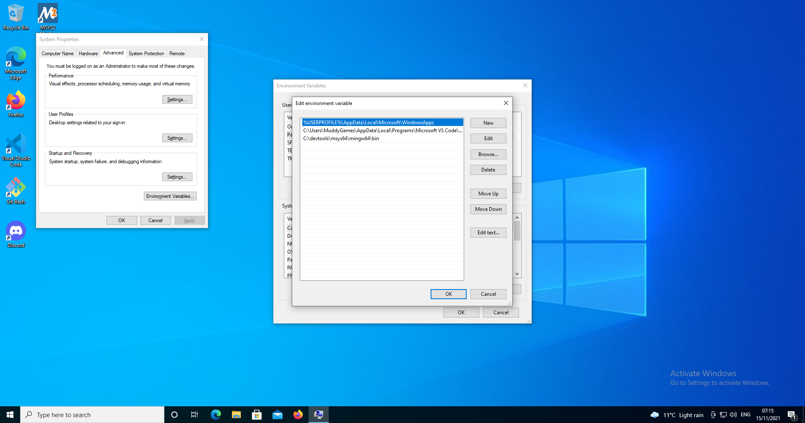

# README #
This project is a **Collison** starter kit for SFML. **Makefile** works on Linux
and windows.
  
## Circle to Circle Collision Detection
Pythagoras theorem is used for Circle to Circle Collision detection.
If the `distance` between the two circles is less than the combined radius `R1 + R2` there is a collision. 

  
  

## Objective
* Fix the collision so that it takes care of SFML draw position which is Top Left
* Add at least 2 other NPCs

## Installation Linux
* Download Repository to your Project Workspace
* Install **SFML** on **debian** based distro using `sudo apt-get install libsfml-dev`
* Navigate to root of project
* type `make`

## Installation Windows
* Download and install [MSYS64](https://www.msys2.org/)  

* Open MSYS Bash
	* **STEP 1** of Updating msys `pacman -Syu` this will shutdown bash when complete.  
	
	* **STEP 2** of Updating msys after this has complete restart MSYS Bash and run `pacman -Su`  
	
	* **STEP 3** (Note this there are multiple commands below, to get toolchain up and running) Open MSYS Bash and install
>   * **STEP 3.1** **mingw gcc** `pacman -S mingw-w64-x86_64-gcc`  

>   * **STEP 3.2** **mingw gdb** `pacman -S mingw-w64-x86_64-gdb`  

>   * **STEP 3.3** **make** `pacman -S make`  

>   * **STEP 3.4** **git** `pacman -S git`  

>   * **STEP 3.5** **SFML** `pacman -S mingw-w64-x86_64-sfml`see [MSYS Website Packages](https://packages.msys2.org/package/mingw-w64-x86_64-sfml).  
 

* **STEP 4** Setup a Windows Environment Variable which points to where `GCC 7.3.0 MinGW (SEH) - 64-bit` is located, also set the location of DLLs in Windows Path.

>   * Restart MSYS64 Bash and check that environment variable exists by typing `echo {SFML_SDK}` in terminal. Also check that you can see includes, libs and DLLs  

* **STEP 5** Create a directory e.g. `Projects` for repository, then `cd c:/Projects' and Clone repository  

* **STEP 6** Navigate to cloned project folder `sfml_game`
>   * Type `make` in MSYS Bash Terminal  

## What is this repository for? ##
* Getting started with Visual Studio Code, SFML and Makefiles on Linux and Windows (Note Makefile will work on both as long as toolchain is setup correctly)
* This is a great Tutorial to get this project running on [Windows](https://www.youtube.com/watch?v=Ljhpsdz8Ouo)

## Who do I talk to? ##
* philip.bourke@itcarlow.ie